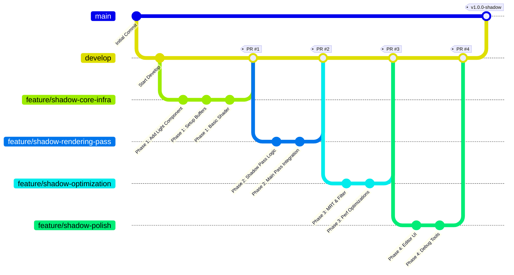

### Git 브랜치 전략: "Feature Branch Workflow" 기반

이 프로젝트는 새로운 기능('그림자')을 추가하는 명확한 목표를 가지고 있으므로, 기능 단위로 브랜치를 관리하는 **Feature Branch Workflow**가 가장 적합합니다.

#### 주요 브랜치

1.  `main` (또는 `master`)
    *   **목적:** **배포 가능한 안정적인 버전**만 관리합니다. 오직 `develop` 브랜치에서 병합(merge)됩니다.
    *   **규칙:** 절대로 `main` 브랜치에 직접 커밋하지 않습니다. 모든 커밋은 태그(Tag)와 함께 릴리스 노트를 가집니다 (예: `v1.0.0-shadow-beta`).

2.  `develop`
    *   **목적:** **다음 릴리스를 위한 개발 통합 브랜치.** 모든 기능 개발이 완료되고 테스트된 후 `feature` 브랜치들이 병합되는 곳입니다.
    *   **규칙:** `main`에서 시작하며, 새로운 기능들이 안정적으로 통합되면 `main`으로 병합됩니다. CI(Continuous Integration)가 설정되어 있다면, 이 브랜치에 푸시될 때마다 자동 빌드 및 기본 테스트가 실행되어야 합니다.

3.  `feature/` (기능 브랜치)
    *   **목적:** **단일 기능을 개발하기 위한 브랜치.** 계획서의 각 'Phase'나 'Step'이 하나의 `feature` 브랜치가 될 수 있습니다.
    *   **규칙:**
        *   항상 `develop` 브랜치에서 시작합니다.
        *   브랜치 이름은 개발 내용을 명확히 나타내야 합니다 (예: `feature/shadow-core-infra`, `feature/shadow-rasterization-pass`).
        *   개발이 완료되면 `develop` 브랜치로 **Pull Request(PR)** 또는 Merge Request(MR)를 생성하여 코드 리뷰를 거친 후 병합합니다.

#### 계획서의 Phase에 맞춘 브랜치 전략 예시



### 단계별 Git 작업 흐름

**Phase 1: Core Infrastructure (Week 1)**

1.  `develop` 브랜치가 최신 상태인지 확인합니다.
    ```bash
    git checkout develop
    git pull origin develop
    ```
2.  Phase 1을 위한 `feature` 브랜치를 생성하고 이동합니다.
    ```bash
    git checkout -b feature/shadow-core-infra
    ```
3.  계획서의 **Step 1.1 ~ 1.4**에 해당하는 내용을 개발합니다. 커밋은 논리적인 단위로 작게 나눕니다.
    *   **좋은 커밋 메시지 예시:**
        *   `feat: Add GaussianDirectionalLight component`
        *   `refactor: Implement separate buffer architecture for shadows`
        *   `feat: Create initial ShadowSplatting shader using rasterization`
        *   `chore: Setup shadow map render texture and post-process compute`
4.  개발이 완료되면, `develop` 브랜치로 Pull Request를 생성합니다.
    *   **PR 설명:** "Phase 1 구현 완료. `GS³` 기반 래스터라이제이션 패스와 분리된 버퍼 아키텍처를 도입함."
5.  코드 리뷰 후, `develop` 브랜치에 병합(Squash and Merge 또는 Rebase and Merge)합니다.

**Phase 2, 3, 4도 동일한 방식으로 진행합니다.**

*   `feature/shadow-rendering-integration`
*   `feature/shadow-optimization-quality`
*   `feature/shadow-polish-and-samples`

### 커밋 메시지 규칙

프로젝트 히스토리의 가독성을 높이기 위해 **Conventional Commits** 규칙을 따르는 것을 강력히 추천합니다.

*   **`feat:`**: 새로운 기능 추가 (예: `feat: Add bilateral filter for shadow refinement`)
*   **`fix:`**: 버그 수정 (예: `fix: Correct shadow bias calculation for orthographic projection`)
*   **`refactor:`**: 코드 구조 변경 (성능 향상이나 가독성 개선 등)
*   **`style:`**: 코드 포맷, 세미콜론 등 (기능 변경 없음)
*   **`docs:`**: 문서 수정
*   **`test:`**: 테스트 코드 추가 또는 수정
*   **`chore:`**: 빌드 스크립트, 패키지 관리 등 (개발과 직접 관련 없는 작업)

**예시:**

```
feat(shadow): Implement MRT for weighted shadow accumulation

- Shadow pass now uses two render targets (Transmittance, Density)
- Added ShadowFinalize post-process shader to compute weighted average
- This improves soft shadow quality as described in the GS³ paper.
```

### 추가적인 Git 관리 팁

1.  **Pull Request(PR) 템플릿 사용:** PR을 올릴 때마다 일관된 형식으로 변경 사항, 테스트 내용, 관련 이슈 등을 기입하도록 템플릿을 만들어두면 코드 리뷰 효율이 올라갑니다.
2.  **작은 단위의 PR:** 가능하면 PR을 너무 크게 만들지 마세요. 계획서의 각 'Step'이 하나의 PR이 될 수도 있습니다. 코드 리뷰가 쉬워지고 버그 추적이 용이해집니다.
3.  **WIP (Work In Progress) PR:** 아직 개발 중이지만 동료의 중간 피드백을 받고 싶을 때, 제목에 `[WIP]`를 붙여 PR을 미리 올리는 것도 좋은 방법입니다.
4.  **`develop` 브랜치와 주기적인 동기화:** `feature` 브랜치에서 작업하는 동안 다른 기능이 `develop`에 병합될 수 있습니다. 충돌(conflict)을 방지하기 위해 주기적으로 `develop`의 최신 내용을 자신의 브랜치로 가져와야 합니다.
    ```bash
    # feature/my-feature 브랜치에서
    git pull origin develop
    ```
