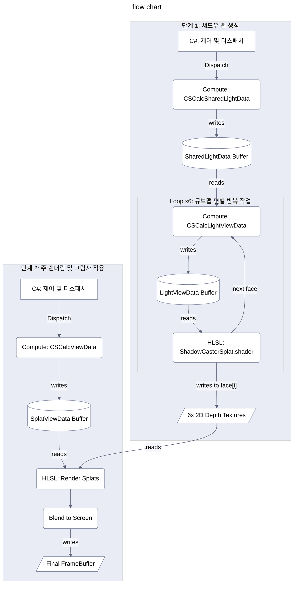

_Read this in other languages: [Korean](./readme.md)
***
# Unity Gaussian Splatting Shadow Rendering

Unity URP(Universal Render Pipeline) 환경에서 Gaussian Splatting 모델에 동적 포인트 라이트 그림자를 구현한 렌더링 시스템이다.

## TL;DR
Unity URP 환경에서 Gaussian Splatting 모델의 동적 포인트 라이트 그림자 구현이 완료되었다. 포인트 라이트 위치에서 6방향으로 뎁스 맵을 렌더링하여 6개의 개별 2D 텍스처에 저장한 후, 주 렌더링 패스에서 이를 샘플링하여 그림자를 적용한다.

### 핵심 파이프라인:
1. **CSCalcSharedLightData (Compute Shader)**: 6번의 렌더링 루프 밖에서 한 번만 실행된다. 스플랫의 로컬 좌표, 월드 좌표, 3D 공분산 등 재사용 가능한 데이터를 계산하여 SharedLightData 버퍼에 저장한다.
2. **CSCalcLightViewData (Compute Shader)**: 큐브맵의 6개 면에 대해 각각 루프를 돌며 실행된다.
    * C#에서 현재 면에 맞는 올바른 GPU 규칙을 따른 _LightViewMatrix와 _LightProjMatrix를 전달받는다.
    * SharedLightData 버퍼를 입력으로 받아, 스플랫의 최종 클립 공간 위치와 화면상 모양(2D 타원 축)을 계산하여 LightViewData 버퍼에 저장한다.
3. **ShadowCasterSplat.shader (Vertex/Fragment Shader)**:
    * LightViewData 버퍼를 읽어 각 스플랫을 뎁스 텍스처에 렌더링(DrawProcedural)하여 깊이 값을 기록한다.

### 해결된 핵심 문제:
문제는 `GaussianSplatShadowRenderer.cs`에서 view matrix와 projection matrix를 생성할 때 GPU의 오른손 좌표계 규칙이 아닌 C# Unity의 왼손 좌표계 규칙을 따라 계산했기 때문에 발생했다. 이는 다음과 같이 해결되었다:
- **View Matrix**: UNITY_MATRIX_V와 동일한 구조로 직접 계산하여 GPU 좌표계 규칙을 준수
- **Projection Matrix**: `GL.GetGPUProjectionMatrix()`를 올바른 순서로 적용하여 GPU 규칙에 맞게 변환
- **전역 변수 사용**: 셰이더 전역 변수를 통한 더 효율적인 파라미터 전달

## 1. 개요 (Overview)

본 문서는 Unity6 URP 환경에서 가우시안 스플래팅(Gaussian Splatting) 모델에 동적 포인트 라이트 그림자를 구현하기 위한 렌더링 파이프라인을 기술한다. 핵심 목표는 광원 위치에서 6방향으로 뎁스 맵(Depth Map)을 생성하여 큐브맵 형태의 그림자 정보를 구성하고, 이를 주 스플랫 렌더링 시 각 스플랫의 그림자 여부를 판정하는 데 사용하는 것이다.

<aside>
💡

큐브맵의 각 면(face)에 직접 렌더링 시 문제가 발생했기 때문에, **6개의 개별 2D 렌더 텍스처에 각 면의 뎁스 정보를 따로 기록**한 후, 주 렌더링 셰이더에서 이 6개의 텍스처를 참조하여 그림자를 계산하는 방식으로 우회하였다.

</aside>

**주요 구성 요소:**

- **`GaussianSplatRenderer.cs`**: 개별 가우시안 스플랫 에셋의 렌더링을 담당하는 주 컴포넌트다.
- **`GaussianSplatShadowRenderer.cs`**: 특정 `GaussianSplatRenderer`에 연결되어 포인트 라이트의 섀도우 맵 생성을 전담하는 컴포넌트다. 6개의 2D 뎁스 텍스처를 관리하고 렌더링 명령을 생성한다.
- **`GaussianSplatURPFeature.cs`**: URP의 `ScriptableRendererFeature`로, 렌더 그래프(Render Graph) 내에 섀도우 맵 생성 패스와 주 스플랫 렌더링 패스를 삽입하고 관리한다.
- **`SplatUtilities.compute` (Compute Shader)**: 스플랫 데이터의 GPU 기반 처리를 담당한다.
    - `CSCalcSharedLightData`: 광원과 무관하게 미리 계산될 수 있는 스플랫 데이터(위치, 3D 공분산, 원본 불투명도 등)를 준비한다.
    - `CSCalcLightViewData`: `CSCalcSharedLightData`의 출력을 받아, 특정 광원 시점에서의 스플랫 뷰 데이터(클립 공간 위치, 2D 타원 축 등)를 계산한다.
- **`ShadowCasterSplat.shader` (HLSL Shader)**: 섀도우 맵 생성 패스에서 사용되며, 각 스플랫을 2D 뎁스 텍스처에 렌더링하여 깊이 값을 기록한다.
- **`RenderGaussianSplats.shader` (HLSL Shader)**: 주 스플랫 렌더링 패스에서 사용되며, 6개의 2D 섀도우 맵 텍스처를 샘플링하여 최종 스플랫 색상에 그림자를 적용한다.
- **`GaussianSplatting.hlsl` (HLSL Include)**: 공통 구조체(예: `SplatData`, `SplatViewData`, `SharedLightData`, `LightViewData`) 및 유틸리티 함수를 포함한다.

## 2. 섀도우 맵 생성 단계 (Shadow Map Generation Phase)

이 단계의 목표는 포인트 라이트 위치에서 6방향으로 씬을 렌더링하여 각 방향에 대한 뎁스 맵을 생성하는 것이다.

### 2.1. `GaussianSplatShadowRenderer.cs`의 역할

- **6개의 2D 뎁스 렌더 텍스처 관리**:
    - `RenderTexture[] m_ShadowFaceRTs`: 비(Non)-URP 경로에서 사용할 6개의 2D `RenderTexture` 배열. `EnsureResourcesAreCreated()`에서 각 면의 해상도(`shadowCubemapResolution`)와 뎁스 포맷(`GraphicsFormat.D32_SFloat` 등)에 맞춰 생성 및 관리된다.
    - `GetShadowFaceDescriptor()`: URP Feature가 Render Graph에서 6개의 2D 뎁스 텍스처 핸들을 생성하는 데 필요한 `RenderTextureDescriptor`를 제공한다. 이 디스크립터는 `dimension = TextureDimension.Tex2D`로 설정된다.
- **컴퓨트 셰이더 및 렌더링 준비**:
    - `EnsureGpuResourcesForCompute()`: `m_LightViewDataBuffer`와 `m_SharedLightDataBuffer` 등 컴퓨트 셰이더에 필요한 GPU 버퍼를 준비한다.
    - `EnsureShadowCasterMaterial()`: `shadowCasterShader`를 사용하는 머티리얼(`m_ShadowCasterMaterial`)을 준비한다.
- **개선된 View/Projection Matrix 계산**:
    - **GPU 호환 Projection Matrix**: `GL.GetGPUProjectionMatrix()`를 올바른 순서로 적용하여 GPU 규칙에 맞게 변환
    - **정확한 View Matrix**: `GetLightViewMatrixForFace()`에서 UNITY_MATRIX_V와 동일한 구조로 직접 계산
    - **전역 셰이더 변수**: `SetGlobalShadowParameters()`를 통해 모든 그림자 관련 파라미터를 전역 변수로 설정
- **URP 연동 메서드**:
    - `RenderShadowFacesURP(CommandBuffer cmd, TextureHandle[] faceTextureHandles)`: URP Feature로부터 `CommandBuffer`와 6개의 2D `TextureHandle` 배열을 전달받는다.
        1. `DispatchSharedDataKernel(cmd)`: `CSCalcSharedLightData` 커널을 디스패치하여 모든 스플랫에 대한 광원 공통 데이터를 미리 계산하고 `m_SharedLightDataBuffer`에 저장한다.
        2. 루프 (6회 반복, 각 큐브맵 면에 대해):
            - `GetLightViewMatrixForFace((CubemapFace)i)`: 현재 면에 대한 **올바른 GPU 규칙을 따른** 광원의 뷰 행렬을 계산한다.
            - **GPU 호환 프로젝션 행렬**: `GL.GetGPUProjectionMatrix(Matrix4x4.Perspective(...), true)`로 적용.
            - 컴퓨트 셰이더 파라미터 설정: `_LightViewMatrix`, `_LightModelViewMatrix`, `_LightProjMatrix`, `_LightScreenParams` 등을 `CSCalcLightViewData` 커널에 설정한다.
            - `CSCalcLightViewData` 커널 디스패치: `m_SharedLightDataBuffer`를 입력으로 받아, 현재 면에 대한 `LightViewData`를 계산하고 `m_LightViewDataBuffer`에 저장한다.
            - `cmd.SetRenderTarget(faceTextureHandles[i])`: URP Feature가 제공한 i번째 2D `TextureHandle`을 렌더 타겟으로 설정한다.
            - `cmd.ClearRenderTarget(true, false, Color.black, 1.0f)`: 뎁스 버퍼만 1.0 (먼 값)으로 클리어한다.
            - `m_ShadowCasterMaterial`에 필요한 버퍼(`_LightSplatViewDataOutput`) 및 유니폼 설정에 `shadowAlphaCutoff` 추가.
            - `cmd.DrawProcedural(...)`: `ShadowCasterSplat.shader`를 사용하여 현재 렌더 타겟(i번째 2D 뎁스 텍스처)에 스플랫을 렌더링한다.
- **기타**: `IsRenderNeeded()`, `MarkShadowsDirty()`, `HasSettingsChanged()`, `UpdatePreviousSettings()` 등 상태 관리 메서드.

### 2.2. `SplatUtilities.compute` (컴퓨트 셰이더)

- **`CSCalcSharedLightData` 커널**:
    - 입력: 원본 스플랫 데이터 (`_SplatPos`, `_SplatOther`, `_SplatColor` 등).
    - 출력: `_SharedLightDataOutput` 버퍼 (`SharedLightData` 구조체 배열).
    - 작업: 각 스플랫의 월드 위치(`centerWorldPos`), 3D 공분산 행렬 요소(`cov3d0`, `cov3d1`), 그리고 필터링 기준을 적용한 불투명도(`opacity`)를 계산하여 저장한다.
- **`CSCalcLightViewData` 커널**:
    - 입력: `_SharedLightDataInput` (위 `CSCalcSharedLightData`의 출력), 광원의 뷰/프로젝션 행렬 (`_LightViewMatrix`, `_LightProjMatrix`), 스크린 파라미터 (`_LightScreenParams`).
    - 출력: `_LightSplatViewDataOutput` 버퍼 (`LightViewData` 구조체 배열).
    - 작업: 각 스플랫에 대해 다음을 계산한다:
        1. `centerClipPos`: `sharedLightData.centerWorldPos`를 `_LightViewMatrix`와 `_LightProjMatrix`로 변환하여 광원 시점의 클립 공간 좌표 계산 (`LightViewData.centerClipPos`).
        2. 후방 컬링: `centerLightClipPos.w <= 0.0001f`이면 컬링.
        3. `CalcCovariance2D`: `centerWorldPos`, `sharedData.cov3d0`, `sharedData.cov3d1` 및 광원의 뷰/프로젝션 행렬을 사용하여 광원 시점에서 투영된 2D 공분산 행렬 계산.
        4. `DecomposeCovariance`: 2D 공분산으로부터 화면 공간 타원 축 `LightViewData.axis1`, `LightViewData.axis2` 계산.
        5. `LightViewData.opacity`: `sharedData.opacity` 재사용.

### 2.3. `ShadowCasterSplat.shader` (HLSL)

- **역할**: 각 스플랫을 광원 시점에서 2D 뎁스 텍스처에 렌더링하여 깊이 값을 기록한다.
- **버텍스 셰이더 (`vert_shadow_caster`)**:
    - 입력: `_LightSplatViewDataOutput` 버퍼 (스플랫별 `LightViewData`).
    - 작업:
        1. `LightViewData`에서 `centerClipPos` (중심 클립 공간 좌표), `axis1`, `axis2` (화면 공간 타원 축), `opacity`를 가져온다.
        2. `centerClipPos.w`를 확인하여 카메라 뒤 컬링.
        3. 로컬 쿼드 정점 좌표(`corner_offset_local`, 보통 `[-2, +2]` 범위)를 생성하여 `output.localPos`로 전달 (프래그먼트 셰이더의 가우시안 모양 계산용).
        4. `output.localPos`, `axis1`, `axis2`, `_LightScreenParams`를 사용하여 화면 공간 오프셋을 계산하고, 이를 클립 공간 오프셋으로 변환.
        5. `posCS.xy`에 클립 공간 오프셋을 더하여 최종 정점 위치 `output.positionCS` 계산. (`z`, `w`는 `posCS`의 값 사용).
        6. (필요시) `FlipProjectionIfBackbuffer` 호출.
- **프래그먼트 셰이더 (`frag_shadow_caster`)**:
    - 입력: `v2f_shadow_caster` (보간된 `localPos`, `splatOpacity`).
    - 작업:
        1. `power = -dot(input.localPos, input.localPos)`로 가우시안 감쇠 계산.
        2. `alpha_shape = exp(power)`로 모양에 따른 알파 계산.
        3. *(선택적)* `input.splatOpacity`에 대한 임계값 또는 `alpha_shape`에 대한 임계값을 사용하여 노이즈 스플랫 `discard`.
        4. `final_alpha = saturate(alpha_shape * input.splatOpacity)`.
        5. `if (final_alpha < THRESHOLD)`이면 `discard`. (THRESHOLD는 `1.0/255.0` 또는 조정된 값)
    - `ZWrite On`과 `ColorMask 0` 설정으로 인해, `discard`되지 않은 픽셀의 깊이 값만 렌더 타겟(2D 뎁스 텍스처)에 기록된다.

### 2.4. `GaussianSplatURPFeature.cs` (섀도우 패스 부분)

- **역할**: URP Render Graph 내에 섀도우 맵 생성 패스를 정의하고 실행한다.
- **`RecordRenderGraph` 메서드 내 섀도우 패스 로직**:
    1. `FindActiveShadowCaster()`를 통해 현재 활성화된 `GaussianSplatShadowRenderer` 인스턴스를 찾는다.
    2. `activeShadowCaster.IsRenderNeeded()`를 확인하여 섀도우 맵 업데이트가 필요한지 판단한다.
    3. 필요하다면, `ShadowPassData`를 사용하여 Render Graph 패스를 추가한다.
    4. `activeShadowCaster.GetShadowFaceDescriptor()`를 호출하여 2D 뎁스 텍스처에 대한 디스크립터를 얻는다.
    5. 루프를 돌며 6개의 2D `TextureHandle` (`passData.shadowFaceHandles[i]`)을 `renderGraph.CreateTexture` (또는 `UniversalRenderer.CreateRenderGraphTexture`)를 사용하여 생성하고, `builder.UseTexture`로 쓰기 접근을 설정한다.
    6. `builder.SetRenderFunc`를 정의:
        - `CommandBuffer`를 가져온다.
        - `activeShadowCaster.RenderShadowFacesURP(cmd, passData.shadowFaceHandles)`를 호출하여, 6개의 2D 텍스처 핸들에 그림자를 렌더링하는 명령을 기록한다.
        - 루프를 돌며 렌더링된 6개의 2D 텍스처 핸들(`passData.shadowFaceHandles[i]`)을 각각 고유한 이름(`s_ShadowMapFaceTextureGlobalIDs_Feature[i]`)으로 `cmd.SetGlobalTexture`를 사용하여 전역 셰이더 변수로 설정한다.
        - `activeShadowCaster.SetShadowParametersOnMainMaterial(resolvedFaceTextures)`를 호출하여 (여기서 `resolvedFaceTextures`는 `context.renderGraph.GetTexture`로 얻은 `RTHandle`에서 `.rt`를 통해 실제 `Texture` 배열로 변환하거나, 텍스처 설정은 전역 변수에 의존하고 이 함수는 비텍스처 유니폼만 설정하도록 할 수 있음) 주 스플랫 머티리얼에 그림자 관련 파라미터를 설정한다.

## 3. 주 스플랫 렌더링 및 그림자 적용 단계 (Main Splat Rendering & Shadow Application Phase)

이 단계에서는 이전 단계에서 생성된 6개의 2D 뎁스 텍스처를 사용하여 주 스플랫 렌더링 시 각 스플랫 픽셀에 그림자를 적용한다.

### 3.1. **`RenderGaussianSplats.shader`** 셰이더 (HLSL)

- **역할**: 가우시안 스플랫을 메인 카메라 시점에서 렌더링하고, 계산된 그림자 정보를 최종 색상에 반영한다.
- **유니폼 선언**:
    - 6개의 `Texture2D` (예: `_ShadowMapFacePX`)와 해당 `SamplerState` (예: `sampler_ShadowMapFacePX`)를 선언하여 6개의 2D 섀도우 맵 면을 받는다.
    - 광원 정보 (`_PointLightPosition`), 그림자 바이어스 (`_ShadowBias`), 광원의 Near/Far Plane (`_LightNearPlaneGS`, `_LightFarPlaneGS`) 등을 유니폼으로 받는다.
- **버텍스 셰이더 (`vert`)**:
    - `SplatViewData`에서 스플랫 중심의 월드 좌표(`view.worldPos_center`)를 읽어 프래그먼트 셰이더로 전달한다 (`o.worldPos`).
    - 기존 로직대로 스플랫의 화면상 위치(`o.clipPos`)와 가우시안 모양 계산용 로컬 좌표(`o.localGaussianPos`) 등을 계산한다.
- **프래그먼트 셰이더 (`frag`)**:
    1. 기존 로직대로 스플랫의 기본 색상(`calculatedColor`)과 모양 알파(`shapeAlpha`), 최종 알파(`finalAlpha`)를 계산하고, 선택된 스플랫 처리 및 `discard` 로직을 수행한다.
    2. **그림자 계산**:
        - `half shadow = SamplePointShadow(i.worldPos)`: 새로운 통합 함수를 호출하여 점광원 그림자 값을 계산한다.
        - 이 함수는 광원의 6개 View-Projection 행렬(`_ShadowMapFaceMatrixPX` 등)을 직접 사용하여 정확한 그림자 계산을 수행한다.
        - 픽셀 위치에 따라 올바른 VP 행렬을 선택하고, NDC 좌표 변환 및 UV 계산을 통해 해당 섀도우 맵에서 깊이 비교를 수행한다.
    3. **최종 색상 적용**:
        - `half3 finalColor = i.col.rgb * shadow`: 계산된 그림자 계수를 스플랫 색상에 곱한다.
        - `return half4(finalColor * alpha, alpha)`: Non-Premultiplied Alpha 형식으로 최종 색상과 알파를 출력한다. (블렌딩 모드 `Blend OneMinusDstAlpha One`과 일치)

### 3.2. `SamplePointShadow` 함수 (HLSL, "**RenderGaussianSplats.shader**" 내)

**개선된 점광원 그림자 계산 함수**

- **입력**: `float3 worldPos` (현재 프래그먼트의 월드 좌표)
- **작업**:
    1. **광원 벡터 계산**: `lightVec = worldPos - _PointLightPosition`으로 광원에서 픽셀로의 벡터 계산
    2. **큐브맵 면 선택**: `absVec = abs(lightVec)`의 최대 성분을 기준으로 X/Y/Z 면 중 적절한 면 선택
    3. **VP 행렬 적용**: 선택된 면에 해당하는 View-Projection 행렬(`_ShadowMapFaceMatrixPX` 등)을 사용하여 `shadowCoord = mul(vpMatrix, float4(worldPos, 1.0))` 계산
    4. **NDC 좌표 변환**: `shadowCoord.xyz /= shadowCoord.w`로 동차 나누기 수행하여 NDC 좌표 획득
    5. **UV 좌표 계산**: NDC 좌표를 0~1 범위의 UV로 변환하고 D3D 환경을 위한 Y 좌표 반전 적용
    6. **깊이 비교**: 해당 섀도우 맵에서 깊이 값을 샘플링하고 현재 픽셀의 깊이와 비교하여 그림자 여부 결정
- **반환값**: `half shadow` (1.0 = 빛을 받음, 0.2 = 그림자 영역)

**주요 개선 사항**:
- VP 행렬을 직접 사용하여 더 정확한 좌표 변환
- 복잡한 UV 계산 로직 단순화
- 깊이 값 선형화 과정 제거로 성능 향상

### 3.3. `GaussianSplatURPFeature.cs` (메인 패스 부분)

- 섀도우 패스에서 `SetGlobalTexture`로 설정된 6개의 2D 섀도우 맵 텍스처와, `SetShadowParametersOnMainMaterial`을 통해 주 스플랫 머티리얼에 설정된 기타 그림자 유니폼(`_PointLightPosition`, `_ShadowBias` 등)을 사용하여 `GaussianSplatRenderSystem.instance.SortAndRenderSplats()`를 호출한다.
- `SortAndRenderSplats` 함수는 "Render Splats" 셰이더를 사용하여 스플랫을 렌더링하며, 이때 프래그먼트 셰이더는 위에서 설명한 그림자 계산 로직을 수행한다.

## 4. 주요 데이터 흐름 및 상호작용

1. **`GaussianSplatRenderer`**: 원본 스플랫 에셋 데이터(위치, 회전, 스케일, 색상, SH 계수 등)를 GPU 버퍼로 로드한다.
2. **`GaussianSplatShadowRenderer`**:
    - 광원 정보(위치, Near/Far Plane, 해상도)를 관리한다.
    - URP Feature에 2D 뎁스 텍스처 생성을 위한 디스크립터를 제공한다.
    - URP Feature로부터 6개의 2D `TextureHandle`을 받아, `CommandBuffer`에 섀도우 맵 생성 명령을 기록한다.
        - `CSCalcSharedLightData` 실행 -> `CSCalcLightViewData` 실행 (각 면에 대해) -> `ShadowCasterSplat.shader`로 `DrawProcedural` (각 면 텍스처에).
    - 주 스플랫 머티리얼에 그림자 관련 유니폼(광원 위치, 바이어스, 6개의 2D 섀도우 맵 텍스처 등)을 설정한다.
3. **`GaussianSplatURPFeature`**:
    - **섀도우 패스**: 6개의 2D 뎁스 `TextureHandle`을 생성하고, `GaussianSplatShadowRenderer`에 전달하여 렌더링을 지시한다. 렌더링된 6개 텍스처를 전역 셰이더 변수로 설정한다.
    - **메인 패스**: `GaussianSplatRenderSystem`을 통해 주 스플랫 렌더링을 수행한다. 이때 사용되는 "Render Splats" 셰이더는 전역으로 설정된 6개의 섀도우 맵 텍스처와 기타 유니폼을 사용하여 그림자를 계산한다.
4. **셰이더**:
    - `SplatUtilities.compute`: 스플랫 데이터를 GPU에서 효율적으로 처리하여 섀도우 패스와 메인 패스에 필요한 형태로 가공한다.
    - `ShadowCasterSplat.shader`: 광원 시점에서 스플랫을 2D 뎁스 텍스처에 그려 깊이 정보를 기록한다.
    - `RenderGaussianSplats.shader` 셰이더: 메인 카메라 시점에서 스플랫을 그리고, 6개의 2D 섀도우 맵을 샘플링하여 그림자를 적용한다.

## 5. 구현된 주요 기능 및 개선 사항

### 해결된 핵심 문제들:
- **View/Projection Matrix 좌표계 문제**: GPU 규칙을 따르는 올바른 행렬 계산으로 해결
- **6방향 그림자 맵 생성**: 큐브맵의 모든 면에서 올바른 뷰 렌더링 확인
- **전역 셰이더 변수 최적화**: 효율적인 파라미터 전달 시스템 구현
- **그림자 계산 단순화**: `SamplePointShadow` 함수를 통한 통합 그림자 계산

### 구현된 기능들:
- **노이즈 스플랫 필터링**:
    - `shadowAlphaCutoff` 파라미터를 통한 조절 가능한 알파 컷오프 (기본값: 0.2)
    - `ShadowCasterSplat.shader`에서 불필요한 노이즈 스플랫 자동 제거
- **정확한 깊이 처리**:
    - 광원의 `lightNearPlane`과 `lightFarPlane` 설정으로 섀도우 맵의 깊이 정밀도 조절
    - VP 행렬을 직접 사용하여 깊이 선형화 과정 제거, 성능 향상
- **올바른 좌표계 및 UV 계산**:
    - `SamplePointShadow` 함수가 `GetLightViewMatrixForFace`의 UNITY_MATRIX_V 호환 구조와 완벽히 일치
    - Unity 큐브맵 렌더링 표준 좌표계 기준 준수
- **성능 최적화**:
    - 전역 셰이더 변수를 통한 효율적인 파라미터 전달
    - 6개의 View-Projection 행렬을 미리 계산하여 전역 변수로 설정 (`_ShadowMapFaceMatrixPX` 등)
    - GPU 최적화된 행렬 계산 순서 적용
    - 복잡한 UV 계산 로직 단순화

### 추가 개선 가능 사항:
- **성능 최적화**:
    - `FindActiveShadowCaster` 메서드의 매 프레임 호출을 중앙 시스템 관리로 최적화 가능
    - 큐브맵 면별 컬링을 통한 불필요한 렌더링 제거 가능
- **품질 향상**:
    - 그림자 맵 해상도를 동적으로 조절하는 LOD 시스템 추가 가능
    - 소프트 섀도우 구현을 위한 PCF(Percentage-Closer Filtering) 적용 가능