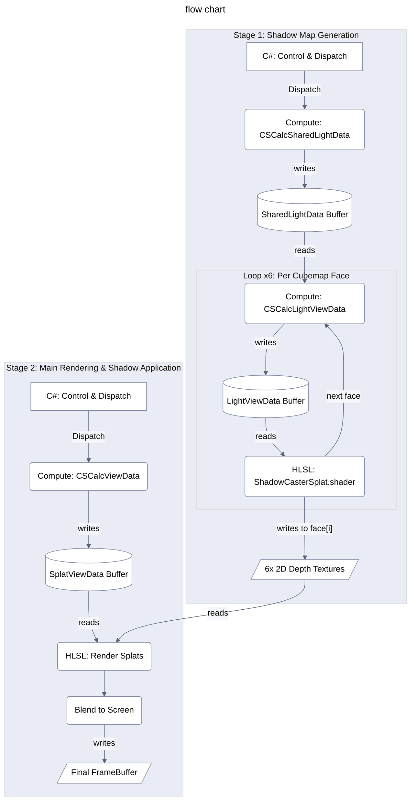

_Read this in other languages: [Korean](./readme.ko.md)
***
# Unity Gaussian Splatting Shadow Rendering

This document describes a rendering system that implements dynamic point light shadows for a Gaussian Splatting model in the Unity Universal Render Pipeline (URP) environment.

## TL;DR

The implementation of dynamic point light shadows for the Gaussian Splatting model in the Unity URP environment is complete. The system renders depth maps from the point light's position in six directions, stores them in six individual 2D textures, and then samples these textures in the main rendering pass to apply shadows.

### Core Pipeline:

1.  **CSCalcSharedLightData (Compute Shader)**: Executed only once outside the six-pass rendering loop. It calculates reusable data such as the splat's local coordinates, world coordinates, and 3D covariance, storing them in the `SharedLightData` buffer.
2.  **CSCalcLightViewData (Compute Shader)**: Executed in a loop for each of the six faces of the cubemap.
      * It receives the correct, GPU-compliant `_LightViewMatrix` and `_LightProjMatrix` from C# for the current face.
      * Using the `SharedLightData` buffer as input, it calculates the splat's final clip-space position and its on-screen shape (2D ellipse axes), storing the results in the `LightViewData` buffer.
3.  **ShadowCasterSplat.shader (Vertex/Fragment Shader)**:
      * Reads the `LightViewData` buffer and renders each splat into the depth texture using `DrawProcedural` to record the depth values.

### Core Problem Solved:

The issue arose because when creating the view matrix and projection matrix in `GaussianSplatShadowRenderer.cs`, calculations followed C# Unity's left-handed coordinate system rule instead of the GPU's right-handed coordinate system rule. This was resolved as follows:

  - **View Matrix**: Directly calculated to match the structure of `UNITY_MATRIX_V`, ensuring compliance with the GPU coordinate system.
  - **Projection Matrix**: Converted to be GPU-compliant by applying `GL.GetGPUProjectionMatrix()` in the correct order.
  - **Global Variables**: Implemented more efficient parameter passing through global shader variables.

<!-- end list -->

## 1. Overview

This document outlines the rendering pipeline for implementing dynamic point light shadows for Gaussian Splatting models in a Unity 6 URP environment. The core objective is to generate depth maps from the light's perspective in six directions to form cubemap-like shadow information. This information is then used during the main splat rendering pass to determine if each splat is in shadow.

Because issues arose when rendering directly to each face of a cubemap, a workaround was adopted: **depth information for each face is recorded in six separate 2D render textures**. The main rendering shader then references these six textures to calculate shadows.

**Key Components:**

  - **`GaussianSplatRenderer.cs`**: The main component responsible for rendering individual Gaussian Splat assets.
  - **`GaussianSplatShadowRenderer.cs`**: A component attached to a specific `GaussianSplatRenderer` that is dedicated to generating shadow maps for a point light. It manages the six 2D depth textures and creates rendering commands.
  - **`GaussianSplatURPFeature.cs`**: A URP `ScriptableRendererFeature` that inserts and manages the shadow map generation pass and the main splat rendering pass within the Render Graph.
  - **`SplatUtilities.compute` (Compute Shader)**: Handles GPU-based processing of splat data.
      - `CSCalcSharedLightData`: Prepares light-independent splat data (e.g., position, 3D covariance, original opacity).
      - `CSCalcLightViewData`: Takes the output from `CSCalcSharedLightData` to calculate view-specific splat data (e.g., clip-space position, 2D ellipse axes) from a particular light's perspective.
  - **`ShadowCasterSplat.shader` (HLSL Shader)**: Used in the shadow map generation pass to render each splat into a 2D depth texture, recording its depth value.
  - **`RenderGaussianSplats.shader` (HLSL Shader)**: Used in the main splat rendering pass. It samples the six 2D shadow map textures to apply shadows to the final splat color.
  - **`GaussianSplatting.hlsl` (HLSL Include)**: Contains common structs (e.g., `SplatData`, `SplatViewData`, `SharedLightData`, `LightViewData`) and utility functions.

-----

## 2. Shadow Map Generation Phase

The goal of this phase is to render the scene from the point light's position in six directions to generate a depth map for each direction.

### 2.1. Role of `GaussianSplatShadowRenderer.cs`

  - **Manages 6 2D Depth Render Textures**:
      - `RenderTexture[] m_ShadowFaceRTs`: An array of six 2D `RenderTexture`s for use in non-URP paths. They are created and managed in `EnsureResourcesAreCreated()` with the appropriate resolution (`shadowCubemapResolution`) and depth format (e.g., `GraphicsFormat.D32_SFloat`).
      - `GetShadowFaceDescriptor()`: Provides the `RenderTextureDescriptor` needed by the URP Feature to create six 2D depth texture handles in the Render Graph. This descriptor is set with `dimension = TextureDimension.Tex2D`.
  - **Prepares Compute Shaders and Rendering**:
      - `EnsureGpuResourcesForCompute()`: Prepares necessary GPU buffers for the compute shaders, such as `m_LightViewDataBuffer` and `m_SharedLightDataBuffer`.
      - `EnsureShadowCasterMaterial()`: Prepares the material (`m_ShadowCasterMaterial`) that uses the `shadowCasterShader`.
  - **Improved View/Projection Matrix Calculation**:
      - **GPU-Compatible Projection Matrix**: Converted using `GL.GetGPUProjectionMatrix()` in the correct order to adhere to GPU conventions.
      - **Accurate View Matrix**: Directly calculated in `GetLightViewMatrixForFace()` with a structure identical to `UNITY_MATRIX_V`.
      - **Global Shader Variables**: Sets all shadow-related parameters as global variables via `SetGlobalShadowParameters()`.
  - **URP Integration Method**:
      - `RenderShadowFacesURP(CommandBuffer cmd, TextureHandle[] faceTextureHandles)`: Receives a `CommandBuffer` and an array of six 2D `TextureHandle`s from the URP Feature.
        1.  `DispatchSharedDataKernel(cmd)`: Dispatches the `CSCalcSharedLightData` kernel to pre-calculate light-common data for all splats and stores it in `m_SharedLightDataBuffer`.
        2.  Loop (iterates 6 times, for each cubemap face):
              - `GetLightViewMatrixForFace((CubemapFace)i)`: Calculates the light's view matrix for the current face, **following correct GPU conventions**.
              - **GPU-Compatible Projection Matrix**: Applies `GL.GetGPUProjectionMatrix(Matrix4x4.Perspective(...), true)`.
              - Sets compute shader parameters: `_LightViewMatrix`, `_LightModelViewMatrix`, `_LightProjMatrix`, `_LightScreenParams`, etc., for the `CSCalcLightViewData` kernel.
              - Dispatches the `CSCalcLightViewData` kernel: Using `m_SharedLightDataBuffer` as input, it calculates `LightViewData` for the current face and stores it in `m_LightViewDataBuffer`.
              - `cmd.SetRenderTarget(faceTextureHandles[i])`: Sets the i-th 2D `TextureHandle` provided by the URP Feature as the render target.
              - `cmd.ClearRenderTarget(true, false, Color.black, 1.0f)`: Clears only the depth buffer to 1.0 (far value).
              - Adds `shadowAlphaCutoff` to the necessary buffer (`_LightSplatViewDataOutput`) and uniform settings for `m_ShadowCasterMaterial`.
              - `cmd.DrawProcedural(...)`: Renders the splats to the current render target (the i-th 2D depth texture) using `ShadowCasterSplat.shader`.
  - **Other**: State management methods like `IsRenderNeeded()`, `MarkShadowsDirty()`, `HasSettingsChanged()`, and `UpdatePreviousSettings()`.

### 2.2. `SplatUtilities.compute` (Compute Shader)

  - **`CSCalcSharedLightData` Kernel**:
      - Input: Original splat data (`_SplatPos`, `_SplatOther`, `_SplatColor`, etc.).
      - Output: `_SharedLightDataOutput` buffer (an array of `SharedLightData` structs).
      - Task: For each splat, it calculates and stores the world position (`centerWorldPos`), 3D covariance matrix elements (`cov3d0`, `cov3d1`), and opacity after applying filtering criteria (`opacity`).
  - **`CSCalcLightViewData` Kernel**:
      - Input: `_SharedLightDataInput` (the output of `CSCalcSharedLightData`), light's view/projection matrices (`_LightViewMatrix`, `_LightProjMatrix`), and screen parameters (`_LightScreenParams`).
      - Output: `_LightSplatViewDataOutput` buffer (an array of `LightViewData` structs).
      - Task: For each splat, it calculates the following:
        1.  `centerClipPos`: Transforms `sharedLightData.centerWorldPos` by `_LightViewMatrix` and `_LightProjMatrix` to get the clip-space coordinates from the light's perspective (`LightViewData.centerClipPos`).
        2.  Back-face culling: Culls if `centerLightClipPos.w <= 0.0001f`.
        3.  `CalcCovariance2D`: Calculates the projected 2D covariance matrix from the light's viewpoint using `centerWorldPos`, `sharedData.cov3d0`, `sharedData.cov3d1`, and the light's view/projection matrices.
        4.  `DecomposeCovariance`: Decomposes the 2D covariance to find the screen-space ellipse axes `LightViewData.axis1` and `LightViewData.axis2`.
        5.  `LightViewData.opacity`: Reuses `sharedData.opacity`.

### 2.3. `ShadowCasterSplat.shader` (HLSL)

  - **Role**: Renders each splat into a 2D depth texture from the light's perspective to record depth values.
  - **Vertex Shader (`vert_shadow_caster`)**:
      - Input: `_LightSplatViewDataOutput` buffer (`LightViewData` per splat).
      - Task:
        1.  Retrieves `centerClipPos`, `axis1`, `axis2`, and `opacity` from `LightViewData`.
        2.  Culls splats behind the camera by checking `centerClipPos.w`.
        3.  Generates local quad vertex coordinates (`corner_offset_local`, typically in the `[-2, +2]` range) and passes them as `output.localPos` for the fragment shader's Gaussian shape calculation.
        4.  Calculates a screen-space offset using `output.localPos`, `axis1`, `axis2`, and `_LightScreenParams`, and converts it to a clip-space offset.
        5.  Adds the clip-space offset to `posCS.xy` to compute the final vertex position `output.positionCS`. (`z` and `w` are taken from `posCS`).
        6.  Calls `FlipProjectionIfBackbuffer` if necessary.
  - **Fragment Shader (`frag_shadow_caster`)**:
      - Input: `v2f_shadow_caster` (interpolated `localPos`, `splatOpacity`).
      - Task:
        1.  Calculates Gaussian falloff: `power = -dot(input.localPos, input.localPos)`.
        2.  Calculates alpha based on the shape: `alpha_shape = exp(power)`.
        3.  *(Optional)* `discard`s noisy splats using a threshold on `input.splatOpacity` or `alpha_shape`.
        4.  `final_alpha = saturate(alpha_shape * input.splatOpacity)`.
        5.  `if (final_alpha < THRESHOLD)` then `discard`. (THRESHOLD is `1.0/255.0` or an adjusted value).
      - Due to `ZWrite On` and `ColorMask 0` settings, only the depth values of pixels that are not `discard`ed are written to the render target (the 2D depth texture).

### 2.4. `GaussianSplatURPFeature.cs` (Shadow Pass Section)

  - **Role**: Defines and executes the shadow map generation pass within the URP Render Graph.
  - **Shadow Pass Logic in `RecordRenderGraph` method**:
    1.  Finds the currently active `GaussianSplatShadowRenderer` instance via `FindActiveShadowCaster()`.
    2.  Checks if a shadow map update is needed by calling `activeShadowCaster.IsRenderNeeded()`.
    3.  If needed, adds a Render Graph pass using `ShadowPassData`.
    4.  Calls `activeShadowCaster.GetShadowFaceDescriptor()` to get the descriptor for the 2D depth textures.
    5.  In a loop, creates six 2D `TextureHandle`s (`passData.shadowFaceHandles[i]`) using `renderGraph.CreateTexture` (or `UniversalRenderer.CreateRenderGraphTexture`) and sets write access with `builder.UseTexture`.
    6.  Defines `builder.SetRenderFunc`:
          - Gets a `CommandBuffer`.
          - Calls `activeShadowCaster.RenderShadowFacesURP(cmd, passData.shadowFaceHandles)` to record the commands for rendering shadows into the six 2D texture handles.
          - In a loop, sets each of the six rendered 2D texture handles (`passData.shadowFaceHandles[i]`) as a global shader variable with a unique name (`s_ShadowMapFaceTextureGlobalIDs_Feature[i]`) using `cmd.SetGlobalTexture`.
          - Calls `activeShadowCaster.SetShadowParametersOnMainMaterial(...)` to set shadow-related parameters on the main splat material. This can be done by resolving `RTHandle`s to actual `Texture`s or by relying on the global textures and having this function only set non-texture uniforms.

-----

## 3. Main Splat Rendering & Shadow Application Phase

In this phase, the six 2D depth textures generated in the previous step are used to apply shadows to each splat pixel during the main rendering pass.

### 3.1. `RenderGaussianSplats.shader` (HLSL)

  - **Role**: Renders Gaussian splats from the main camera's perspective and incorporates the calculated shadow information into the final color.
  - **Uniform Declarations**:
      - Declares six `Texture2D`s (e.g., `_ShadowMapFacePX`) and their corresponding `SamplerState`s (e.g., `sampler_ShadowMapFacePX`) to receive the six 2D shadow map faces.
      - Receives uniforms for light information (`_PointLightPosition`), shadow bias (`_ShadowBias`), and the light's near/far planes (`_LightNearPlaneGS`, `_LightFarPlaneGS`).
  - **Vertex Shader (`vert`)**:
      - Reads the splat's world-space center position (`view.worldPos_center`) from `SplatViewData` and passes it to the fragment shader (`o.worldPos`).
      - Calculates the splat's on-screen position (`o.clipPos`) and local coordinates for Gaussian shape calculation (`o.localGaussianPos`) as per the existing logic.
  - **Fragment Shader (`frag`)**:
    1.  Calculates the splat's base color (`calculatedColor`), shape alpha (`shapeAlpha`), and final alpha (`finalAlpha`) according to the existing logic, and performs selection and `discard` logic.
    2.  **Shadow Calculation**:
          - `half shadow = SamplePointShadow(i.worldPos)`: Calls a new, unified function to calculate the point light shadow value.
          - This function uses the light's six View-Projection matrices (e.g., `_ShadowMapFaceMatrixPX`) directly for accurate shadow calculation.
          - It selects the correct VP matrix based on the pixel position, performs NDC transformation and UV calculation, and then performs a depth comparison on the corresponding shadow map.
    3.  **Final Color Application**:
          - `half3 finalColor = i.col.rgb * shadow`: Multiplies the calculated shadow coefficient with the splat color.
          - `return half4(finalColor * alpha, alpha)`: Outputs the final color and alpha in a non-premultiplied format (to match the `Blend OneMinusDstAlpha One` blend mode).

### 3.2. `SamplePointShadow` Function (in `RenderGaussianSplats.shader`)

**Improved Point Light Shadow Calculation Function**

  - **Input**: `float3 worldPos` (world-space position of the current fragment).
  - **Task**:
    1.  **Calculate Light Vector**: `lightVec = worldPos - _PointLightPosition`.
    2.  **Select Cubemap Face**: Chooses the appropriate X, Y, or Z face based on the largest component of `absVec = abs(lightVec)`.
    3.  **Apply VP Matrix**: Uses the selected face's View-Projection matrix (e.g., `_ShadowMapFaceMatrixPX`) to calculate `shadowCoord = mul(vpMatrix, float4(worldPos, 1.0))`.
    4.  **NDC Transformation**: Performs perspective divide `shadowCoord.xyz /= shadowCoord.w` to get NDC coordinates.
    5.  **UV Calculation**: Converts NDC coordinates to the 0-1 UV range and applies a Y-coordinate flip for the D3D environment.
    6.  **Depth Comparison**: Samples the depth value from the corresponding shadow map and compares it with the current pixel's depth to determine if it is in shadow.
  - **Return Value**: `half shadow` (1.0 = lit, 0.2 = shadowed).

**Key Improvements**:

  - More accurate coordinate transformation by using the VP matrix directly.
  - Simplified UV calculation logic.
  - Improved performance by removing the depth linearization step.

### 3.3. `GaussianSplatURPFeature.cs` (Main Pass Section)

  - Calls `GaussianSplatRenderSystem.instance.SortAndRenderSplats()`, which uses the six 2D shadow map textures set as global variables in the shadow pass, along with other shadow uniforms (`_PointLightPosition`, `_ShadowBias`, etc.) set on the main splat material via `SetShadowParametersOnMainMaterial`.
  - The `SortAndRenderSplats` function renders the splats using the "Render Splats" shader, whose fragment shader executes the shadow calculation logic described above.

-----

## 4. Main Data Flow and Interaction

1.  **`GaussianSplatRenderer`**: Loads the original splat asset data (position, rotation, scale, color, SH coefficients, etc.) into GPU buffers.
2.  **`GaussianSplatShadowRenderer`**:
      - Manages light information (position, near/far planes, resolution).
      - Provides the descriptor for creating 2D depth textures to the URP Feature.
      - Receives six 2D `TextureHandle`s from the URP Feature and records shadow map generation commands into a `CommandBuffer`.
          - Executes `CSCalcSharedLightData` -> Executes `CSCalcLightViewData` (for each face) -> `DrawProcedural` with `ShadowCasterSplat.shader` (for each face texture).
      - Sets shadow-related uniforms (light position, bias, the six 2D shadow map textures, etc.) on the main splat material.
3.  **`GaussianSplatURPFeature`**:
      - **Shadow Pass**: Creates six 2D depth `TextureHandle`s, passes them to `GaussianSplatShadowRenderer` to command rendering, and then sets the six resulting textures as global shader variables.
      - **Main Pass**: Triggers the main splat rendering via `GaussianSplatRenderSystem`. The "Render Splats" shader used in this pass utilizes the globally set shadow map textures and other uniforms to calculate shadows.
4.  **Shaders**:
      - `SplatUtilities.compute`: Efficiently processes splat data on the GPU, transforming it into the required format for both the shadow and main passes.
      - `ShadowCasterSplat.shader`: Draws splats from the light's perspective into 2D depth textures to record depth information.
      - `RenderGaussianSplats.shader`: Draws splats from the main camera's perspective and samples the six 2D shadow maps to apply shadows.

-----

## 5. Implemented Features and Improvements

### Key Problems Solved:

  - **View/Projection Matrix Coordinate System Issue**: Resolved by correctly calculating matrices that adhere to GPU conventions.
  - **6-Directional Shadow Map Generation**: Verified correct view rendering for all cubemap faces.
  - **Global Shader Variable Optimization**: Implemented an efficient parameter-passing system.
  - **Simplified Shadow Calculation**: Unified shadow calculation logic within the `SamplePointShadow` function.

### Implemented Features:

  - **Noise Splat Filtering**:
      - Adjustable alpha cutoff via the `shadowAlphaCutoff` parameter (default: 0.2).
      - Automatic removal of unnecessary noisy splats in `ShadowCasterSplat.shader`.
  - **Accurate Depth Handling**:
      - Adjustable shadow map depth precision using the light's `lightNearPlane` and `lightFarPlane` settings.
      - Improved performance by removing the depth linearization step through direct VP matrix usage.
  - **Correct Coordinate System and UV Calculation**:
      - The `SamplePointShadow` function is perfectly aligned with the `UNITY_MATRIX_V` compatible structure of `GetLightViewMatrixForFace`.
      - Adherence to Unity's standard coordinate system for cubemap rendering.
  - **Performance Optimizations**:
      - Efficient parameter passing via global shader variables.
      - Pre-calculation of the six View-Projection matrices, set as global variables (e.g., `_ShadowMapFaceMatrixPX`).
      - Application of a GPU-optimized matrix calculation order.
      - Simplified complex UV calculation logic.

### Potential Future Improvements:

  - **Performance Optimization**:
      - The per-frame call to `FindActiveShadowCaster` could be optimized by moving to a centrally managed system.
      - Unnecessary rendering could be avoided by implementing per-cubemap-face culling.
  - **Quality Enhancement**:
      - An LOD system could be added to dynamically adjust shadow map resolution.
      - Percentage-Closer Filtering (PCF) could be applied to implement soft shadows.