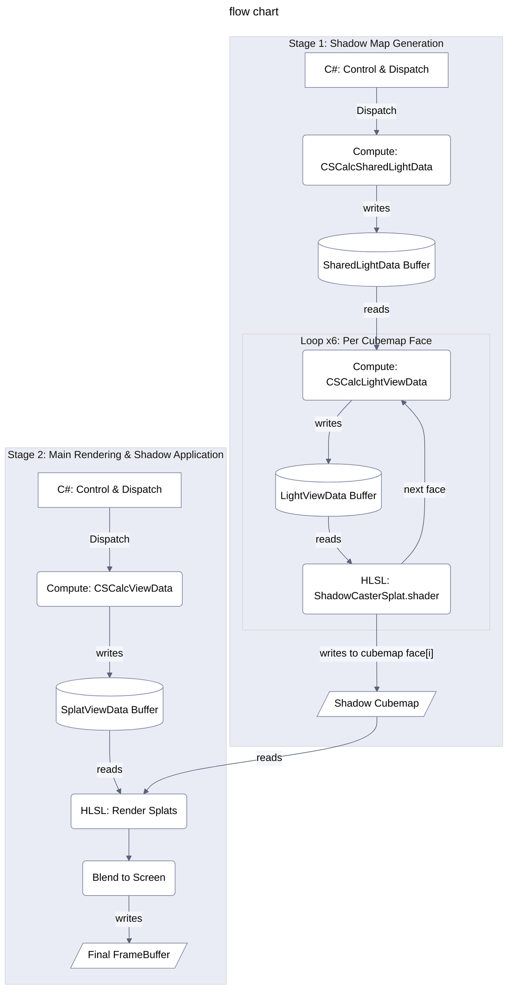

_Read this in other languages: [Korean](./readme.ko.md)
***
# Unity Gaussian Splatting Shadow Rendering

This document describes a rendering system that implements dynamic point light shadows for a Gaussian Splatting model in the Unity Universal Render Pipeline (URP) environment.

## TL;DR

The implementation of dynamic point light shadows for the Gaussian Splatting model in the Unity URP environment is complete. The system renders depth from the point light's position into a single cube `RenderTexture` (six faces) and then samples that cubemap during the main rendering pass to apply shadows.

### Core Pipeline:

1.  **CSCalcSharedLightData (Compute Shader)**: Executed only once outside the six-pass rendering loop. It calculates reusable data such as the splat's local coordinates, world coordinates, and 3D covariance, storing them in the `SharedLightData` buffer.
2.  **CSCalcLightViewData (Compute Shader)**: Executed in a loop for each of the six faces of the cubemap.
      * It receives the correct, GPU-compliant `_LightViewMatrix` and `_LightProjMatrix` from C# for the current face.
      * Using the `SharedLightData` buffer as input, it calculates the splat's final clip-space position and its on-screen shape (2D ellipse axes), storing the results in the `LightViewData` buffer.
3.  **ShadowCasterSplat.shader (Vertex/Fragment Shader)**:
      * Reads the `LightViewData` buffer and renders each splat into the currently bound cubemap face (depth + color disabled) using `DrawProcedural`, recording depth for that face.

### Core Problem Solved:

The issue arose because when creating the view matrix and projection matrix in `GaussianSplatShadowRenderer.cs`, calculations followed C# Unity's left-handed coordinate system rule instead of the GPU's right-handed coordinate system rule. This was resolved as follows:

  - **View Matrix**: Directly calculated to match the structure of `UNITY_MATRIX_V`, ensuring compliance with the GPU coordinate system.
  - **Projection Matrix**: Converted to be GPU-compliant by applying `GL.GetGPUProjectionMatrix()` in the correct order.
  - **Global Variables**: Implemented more efficient parameter passing through global shader variables.

<!-- end list -->

```mermaid
---
title: flow chart
---
%%{
  init: {
    'theme': 'base',
    'themeVariables': {
      'primaryColor': '#ffffff',
      'primaryTextColor': '#000',
      'primaryBorderColor': '#7C839D',
      'lineColor': '#5C6178',
      'secondaryColor': '#F4F6FB',
      'tertiaryColor': '#E9ECF5'
    }
  }
}%%

graph TD
    accTitle: Gaussian Splatting Shadow Pipeline
    accDescr: A two-stage process for generating dynamic shadows for Gaussian Splatting. Stage 1 generates the shadow maps, and Stage 2 performs the main rendering and applies the shadows.

    %% ==========================================
    %% Stage 1: Shadow Map Generation
    %% ==========================================
    subgraph "Stage 1: Shadow Map Generation"
        direction TB

        %% Control and Pre-Loop Nodes
        S1_Control["C#: Control & Dispatch"]
        S1_CS1(Compute: CSCalcSharedLightData)
        S1_Data1[(SharedLightData Buffer)]
        S1_Result[/Shadow Cubemap/]

        %% Flow: Control -> Enters Loop
        S1_Control -- Dispatch --> S1_CS1
        S1_CS1 -- "writes" --> S1_Data1

        %% <<< Nested Subgraph for the Loop >>>
        subgraph "Loop x6: Per Cubemap Face"
            direction TB
            S1_CS2(Compute: CSCalcLightViewData)
            S1_Data2[(LightViewData Buffer)]
            S1_HLSL(HLSL: ShadowCasterSplat.shader)

            %% Inner Loop Flow
            S1_HLSL -- "next face" --> S1_CS2

            %% Inner Loop Data Flow
            S1_CS2 -- "writes" --> S1_Data2
            S1_Data2 -- "reads" --> S1_HLSL
        end
        
        %% Outer Loop Data Flow
        S1_Data1 -- "reads" --> S1_CS2
        S1_HLSL -- "writes to cubemap face[i]" --> S1_Result
    end

    %% ==========================================
    %% Stage 2: Main Rendering & Shadow Application
    %% ==========================================
    subgraph "Stage 2: Main Rendering & Shadow Application"
        direction TB
        S2_Control["C#: Control & Dispatch"]
        S2_CS(Compute: CSCalcViewData)
        S2_Data1[(SplatViewData Buffer)]
        S2_HLSL(HLSL: Render Splats)
        S2_Blend(Blend to Screen)
        S2_Result[/Final FrameBuffer/]
        S2_Control -- Dispatch --> S2_CS
        S2_HLSL --> S2_Blend
        S2_CS -- "writes" --> S2_Data1
        S2_Data1 -- "reads" --> S2_HLSL
        S2_Blend -- "writes" --> S2_Result
    end

    %% Connection Between Stages
    S1_Result -- "reads" --> S2_HLSL
```

## 1. Overview

This document outlines the rendering pipeline for implementing dynamic point light shadows for Gaussian Splatting models in a Unity 6 URP environment. The core objective is to generate depth from the light's perspective in six directions and store the results in a single shadow cubemap. This cubemap is then sampled during the main splat rendering pass to determine whether each splat is lit or shadowed.

Earlier versions relied on six individual 2D render textures as a workaround. The pipeline now renders directly into a GPU cubemap (`RenderTextureDimension.Cube`), eliminating the extra bookkeeping while keeping the per-face compute shader workflow intact.

**Key Components:**

  - **`GaussianSplatRenderer.cs`**: The main component responsible for rendering individual Gaussian Splat assets.
  - **`GaussianSplatShadowRenderer.cs`**: A component attached to a specific `GaussianSplatRenderer` that is dedicated to generating shadow maps for a point light. It manages the shared shadow cubemap and records rendering commands.
  - **`GaussianSplatURPFeature.cs`**: A URP `ScriptableRendererFeature` that inserts and manages the shadow map generation pass and the main splat rendering pass within the Render Graph.
  - **`SplatUtilities.compute` (Compute Shader)**: Handles GPU-based processing of splat data.
      - `CSCalcSharedLightData`: Prepares light-independent splat data (e.g., position, 3D covariance, original opacity).
      - `CSCalcLightViewData`: Takes the output from `CSCalcSharedLightData` to calculate view-specific splat data (e.g., clip-space position, 2D ellipse axes) from a particular light's perspective.
  - **`ShadowCasterSplat.shader` (HLSL Shader)**: Used in the shadow map generation pass to render each splat into the cubemap's depth faces.
  - **`RenderGaussianSplats.shader` (HLSL Shader)**: Used in the main splat rendering pass. It samples the shadow cubemap to apply shadows to the final splat color.
  - **`GaussianSplatting.hlsl` (HLSL Include)**: Contains common structs (e.g., `SplatData`, `SplatViewData`, `SharedLightData`, `LightViewData`) and utility functions.

-----

## 2. Shadow Map Generation Phase

The goal of this phase is to render the scene from the point light's position in six directions to generate a depth map for each direction.

### 2.1. Role of `GaussianSplatShadowRenderer.cs`

  - **Manages the Shadow Cubemap**:
      - `RenderTexture m_ShadowCubemapRT`: A reusable cube `RenderTexture` that stores the six depth faces. `GetOrCreateShadowCubemap()` allocates (or reuses) the resource with the requested resolution and depth format.
      - `HasValidShadowCubemap`: Tracks whether the cubemap currently contains up-to-date shadow data so unnecessary renders can be skipped.
  - **Prepares Compute Shaders and Rendering**:
      - `EnsureGpuResourcesForCompute()`: Prepares necessary GPU buffers for the compute shaders, such as `m_LightViewDataBuffer` and `m_SharedLightDataBuffer`.
      - `EnsureShadowCasterMaterial()`: Prepares the material (`m_ShadowCasterMaterial`) that uses the `shadowCasterShader`.
  - **Accurate View/Projection Matrix Calculation**:
      - **GPU-Compatible Projection Matrix**: Converted using `GL.GetGPUProjectionMatrix()` in the correct order to adhere to GPU conventions.
      - **View Matrices Per Face**: Directly calculated in `GetLightViewMatrixForFace()` with a structure identical to `UNITY_MATRIX_V` for each cubemap face.
      - **Global Shader Variables**: Sets light position, bias, near/far planes, brightness controls, and `ZBufferParams` via `SetGlobalShadowParameters()`.
  - **URP Integration Method**:
      - `RenderShadowFacesURP(CommandBuffer cmd, RenderTexture shadowCubemap)`: Receives a `CommandBuffer` and the shared cubemap.
        1.  `DispatchSharedDataKernel(cmd)`: Dispatches the `CSCalcSharedLightData` kernel once to pre-calculate light-common data for all splats and stores it in `m_SharedLightDataBuffer`.
        2.  Loop (iterates 6 times, once per cubemap face):
              - `GetLightViewMatrixForFace((CubemapFace)i)`: Calculates the light's view matrix for the current face, **following correct GPU conventions**.
              - Applies the GPU-compatible projection matrix (`GL.GetGPUProjectionMatrix(Matrix4x4.Perspective(...), true)`).
              - Updates compute shader parameters (`_LightViewMatrix`, `_LightModelViewMatrix`, `_LightProjMatrix`, `_LightScreenParams`, etc.) and dispatches `CSCalcLightViewData` to populate `m_LightViewDataBuffer` for that face.
              - `cmd.SetRenderTarget(shadowCubemap, 0, face)`: Binds the correct face of the cubemap as the depth render target.
              - `cmd.ClearRenderTarget(true, false, Color.clear, 1.0f)`: Clears only the depth buffer of the current face.
              - Configures a `MaterialPropertyBlock` (including `shadowAlphaCutoff`) and issues `cmd.DrawProcedural(...)` with `ShadowCasterSplat.shader` to write depth into the face.
        3.  Marks the cubemap as valid unless debug overrides force a re-render.
  - **Other**: State management methods like `IsRenderNeeded()`, `MarkShadowsDirty()`, `HasSettingsChanged()`, and `UpdatePreviousSettings()`.

### 2.2. `SplatUtilities.compute` (Compute Shader)

  - **`CSCalcSharedLightData` Kernel**:
      - Input: Original splat data (`_SplatPos`, `_SplatOther`, `_SplatColor`, etc.).
      - Output: `_SharedLightDataOutput` buffer (an array of `SharedLightData` structs).
      - Task: For each splat, it calculates and stores the world position (`centerWorldPos`), 3D covariance matrix elements (`cov3d0`, `cov3d1`), and opacity after applying filtering criteria (`opacity`).
  - **`CSCalcLightViewData` Kernel**:
      - Input: `_SharedLightDataInput` (the output of `CSCalcSharedLightData`), light's view/projection matrices (`_LightViewMatrix`, `_LightProjMatrix`), and screen parameters (`_LightScreenParams`).
      - Output: `_LightSplatViewDataOutput` buffer (an array of `LightViewData` structs).
      - Task: For each splat, it calculates the following:
        1.  `centerClipPos`: Transforms `sharedLightData.centerWorldPos` by `_LightViewMatrix` and `_LightProjMatrix` to get the clip-space coordinates from the light's perspective (`LightViewData.centerClipPos`).
        2.  Back-face culling: Culls if `centerLightClipPos.w <= 0.0001f`.
        3.  `CalcCovariance2D`: Calculates the projected 2D covariance matrix from the light's viewpoint using `centerWorldPos`, `sharedData.cov3d0`, `sharedData.cov3d1`, and the light's view/projection matrices.
        4.  `DecomposeCovariance`: Decomposes the 2D covariance to find the screen-space ellipse axes `LightViewData.axis1` and `LightViewData.axis2`.
        5.  `LightViewData.opacity`: Reuses `sharedData.opacity`.

### 2.3. `ShadowCasterSplat.shader` (HLSL)

  - **Role**: Renders each splat into the active cubemap face from the light's perspective to record depth values.
  - **Vertex Shader (`vert_shadow_caster`)**:
      - Input: `_LightSplatViewDataOutput` buffer (`LightViewData` per splat).
      - Task:
        1.  Retrieves `centerClipPos`, `axis1`, `axis2`, and `opacity` from `LightViewData`.
        2.  Culls splats behind the camera by checking `centerClipPos.w`.
        3.  Generates local quad vertex coordinates (`corner_offset_local`, typically in the `[-2, +2]` range) and passes them as `output.localPos` for the fragment shader's Gaussian shape calculation.
        4.  Calculates a screen-space offset using `output.localPos`, `axis1`, `axis2`, and `_LightScreenParams`, and converts it to a clip-space offset.
        5.  Adds the clip-space offset to `posCS.xy` to compute the final vertex position `output.positionCS`. (`z` and `w` are taken from `posCS`).
        6.  Calls `FlipProjectionIfBackbuffer` if necessary.
  - **Fragment Shader (`frag_shadow_caster`)**:
      - Input: `v2f_shadow_caster` (interpolated `localPos`, `splatOpacity`).
      - Task:
        1.  Calculates Gaussian falloff: `power = -dot(input.localPos, input.localPos)`.
        2.  Calculates alpha based on the shape: `alpha_shape = exp(power)`.
        3.  *(Optional)* `discard`s noisy splats using a threshold on `input.splatOpacity` or `alpha_shape`.
        4.  `final_alpha = saturate(alpha_shape * input.splatOpacity)`.
        5.  `if (final_alpha < THRESHOLD)` then `discard`. (THRESHOLD is `1.0/255.0` or an adjusted value).
      - Due to `ZWrite On` and `ColorMask 0` settings, only the depth values of pixels that are not `discard`ed are written to the bound cubemap face.

### 2.4. `GaussianSplatURPFeature.cs` (Shadow Pass Section)

  - **Role**: Defines and executes the shadow map generation pass within the URP Render Graph.
  - **Shadow Pass Logic in `RecordRenderGraph` method**:
    1.  Finds the currently active `GaussianSplatShadowRenderer` instance via `FindActiveShadowCaster()`.
    2.  Checks if a shadow map update is needed by calling `activeShadowCaster.IsRenderNeeded()`.
    3.  Adds a Render Graph pass that:
          - Retrieves (or allocates) the shared cubemap through `activeShadowCaster.GetOrCreateShadowCubemap()`.
          - If rendering is required, invokes `activeShadowCaster.RenderShadowFacesURP(cmd, cubemap)` to refresh the data.
          - Aborts early if the cubemap could not be created or remains invalid.
          - Sets the cubemap as a global texture (`_ShadowCubemap`) and pushes shadow-related uniforms via `activeShadowCaster.SetGlobalShadowParameters()` so subsequent passes can sample it.

-----

## 3. Main Splat Rendering & Shadow Application Phase

In this phase, the cubemap generated in the previous step is sampled to apply shadows to each splat pixel during the main rendering pass.

### 3.1. `RenderGaussianSplats.shader` (HLSL)

  - **Role**: Renders Gaussian splats from the main camera's perspective and incorporates the calculated shadow information into the final color.
  - **Uniform Declarations**:
      - Declares a single `TEXTURECUBE(_ShadowCubemap)` with its sampler to access the six faces.
      - Receives uniforms for light information (`_PointLightPosition`), shadow bias (`_ShadowBias`), the light's near/far planes (`_LightNearPlaneGS`, `_LightFarPlaneGS`), `_LightZBufferParams`, and brightness controls (`_LightBrightness`, `_ShadowBrightness`).
  - **Vertex Shader (`vert`)**:
      - Reads the splat's world-space center position (`view.worldPos_center`) from `SplatViewData` and passes it to the fragment shader (`o.worldPos`).
      - Calculates the splat's on-screen position (`o.clipPos`) and local coordinates for Gaussian shape calculation (`o.localGaussianPos`) as per the existing logic.
  - **Fragment Shader (`frag`)**:
    1.  Calculates the splat's base color (`calculatedColor`), shape alpha (`shapeAlpha`), and final alpha (`finalAlpha`) according to the existing logic, and performs selection and `discard` logic.
    2.  **Shadow Calculation**:
          - `half visibility = SamplePointShadow(i.worldPos)`: Samples the shadow cubemap and compares depth against the current fragment.
          - The helper picks the dominant axis of `lightVec`, samples the cubemap with that direction, linearizes the stored depth via `_LightZBufferParams`, and applies `_ShadowBias` before producing a 0–1 visibility value.
    3.  **Final Color Application**:
          - `half lightIntensity = lerp(_ShadowBrightness, _LightBrightness, visibility)` scales between lit and shadow brightness.
          - `return half4(i.col.rgb * lightIntensity * alpha, alpha)` outputs the final contribution using the existing blend mode.

### 3.2. `SamplePointShadow` Function (in `RenderGaussianSplats.shader`)

**Improved Point Light Shadow Calculation Function**

  - **Input**: `float3 worldPos` (world-space position of the current fragment).
  - **Task**:
    1.  **Calculate Light Vector**: `lightVec = worldPos - _PointLightPosition`.
    2.  **Compute Linear Depth**: Uses the dominant component of `abs(lightVec)` as the fragment's current linear depth relative to the light.
    3.  **Sample Cubemap**: Fetches the stored depth (`shadowMapNonLinearDepth`) with `SAMPLE_TEXTURECUBE(_ShadowCubemap, sampler_ShadowCubemap, lightVec)`.
    4.  **Linearize Depth**: Converts the stored value to linear space via `LinearEyeDepth(shadowMapNonLinearDepth, _LightZBufferParams)`.
    5.  **Depth Comparison**: Compares `currentLinearDepth` against the sampled depth plus `_ShadowBias` to determine visibility.
  - **Return Value**: `half visibility` (1.0 = lit, 0.0 = shadowed).

**Key Improvements**:

  - Eliminates manual UV reconstruction and per-face VP matrix selection in the fragment stage.
  - Leverages the hardware cubemap sampler, reducing shader constants and texture bindings.
  - Centralizes depth linearization through `_LightZBufferParams`, matching Unity's built-in handling of reversed or standard Z buffers.

### 3.3. `GaussianSplatURPFeature.cs` (Main Pass Section)

  - Calls `GaussianSplatRenderSystem.instance.SortAndRenderSplats()`, which relies on the global shadow cubemap and uniforms (`_PointLightPosition`, `_ShadowBias`, `_LightBrightness`, `_ShadowBrightness`, `_LightZBufferParams`, etc.) populated during the shadow pass.
  - The `SortAndRenderSplats` function renders the splats using the "Render Splats" shader, whose fragment shader samples `_ShadowCubemap` to apply the visibility calculated in `SamplePointShadow`.

-----

## 4. Main Data Flow and Interaction

1.  **`GaussianSplatRenderer`**: Loads the original splat asset data (position, rotation, scale, color, SH coefficients, etc.) into GPU buffers.
2.  **`GaussianSplatShadowRenderer`**:
      - Manages light information (position, near/far planes, resolution) and owns the reusable shadow cubemap.
      - Records the compute + draw workload that populates each cubemap face (`CSCalcSharedLightData` → `CSCalcLightViewData` × 6 → `DrawProcedural` with `ShadowCasterSplat.shader`).
      - Pushes global uniforms through `SetGlobalShadowParameters()` so other passes can read `_ShadowCubemap` and associated settings.
3.  **`GaussianSplatURPFeature`**:
      - **Shadow Pass**: Retrieves the active `GaussianSplatShadowRenderer`, ensures the cubemap exists, optionally re-renders it, and sets `_ShadowCubemap` plus related globals.
      - **Main Pass**: Triggers the main splat rendering via `GaussianSplatRenderSystem`. The "Render Splats" shader samples the globally bound cubemap and applies the visibility values.
4.  **Shaders**:
      - `SplatUtilities.compute`: Efficiently processes splat data on the GPU, transforming it into the required format for both the shadow and main passes.
      - `ShadowCasterSplat.shader`: Draws splats from the light's perspective into the cubemap faces to record depth information.
      - `RenderGaussianSplats.shader`: Draws splats from the main camera's perspective and samples `_ShadowCubemap` to blend lit/shadowed contributions.

-----

## 5. Implemented Features and Improvements

### Key Problems Solved:

  - **View/Projection Matrix Coordinate System Issue**: Resolved by correctly calculating matrices that adhere to GPU conventions.
  - **Shadow Cubemap Consolidation**: Replaced six standalone render textures with a single cube `RenderTexture` while keeping correct per-face rendering.
  - **Global Shader Variable Optimization**: Implemented an efficient parameter-passing system, including `_ShadowCubemap`, `_LightZBufferParams`, and brightness controls.
  - **Simplified Shadow Calculation**: Unified the sampling logic in `SamplePointShadow`, leveraging the hardware cubemap sampler.

### Implemented Features:

  - **Noise Splat Filtering**:
      - Adjustable alpha cutoff via the `shadowAlphaCutoff` parameter (default: 0.2).
      - Automatic removal of unnecessary noisy splats in `ShadowCasterSplat.shader`.
  - **Accurate Depth Handling**:
      - Adjustable shadow map depth precision using the light's `lightNearPlane` and `lightFarPlane` settings.
      - Consistent interpretation of stored depth through `_LightZBufferParams` and `LinearEyeDepth`, regardless of reversed or normal Z configuration.
  - **Shadow Cubemap Integration**:
      - `RenderShadowFacesURP` writes directly into a cube `RenderTexture`, keeping all six faces synchronized and avoiding per-face texture management.
      - `SetGlobalShadowParameters()` exposes `_ShadowCubemap`, `_LightBrightness`, and `_ShadowBrightness` so any pass can query the lighting state.
  - **Correct Coordinate System & Sampling**:
      - `GetLightViewMatrixForFace()` still mirrors `UNITY_MATRIX_V`, ensuring the compute stage matches hardware cubemap conventions.
      - `SamplePointShadow` relies on the cubemap sampler instead of manually reconstructing UVs, reducing shader branching.
  - **Performance Optimizations**:
      - Fewer texture bindings in the main pass (one cubemap instead of six 2D textures).
      - The cubemap resource is reused across frames, minimizing allocations and command-buffer churn.

### Potential Future Improvements:

  - **Performance Optimization**:
      - The per-frame call to `FindActiveShadowCaster` could be optimized by moving to a centrally managed system.
      - Unnecessary rendering could be avoided by implementing per-cubemap-face culling.
  - **Quality Enhancement**:
      - An LOD system could be added to dynamically adjust shadow map resolution.
      - Percentage-Closer Filtering (PCF) could be applied to implement soft shadows.
